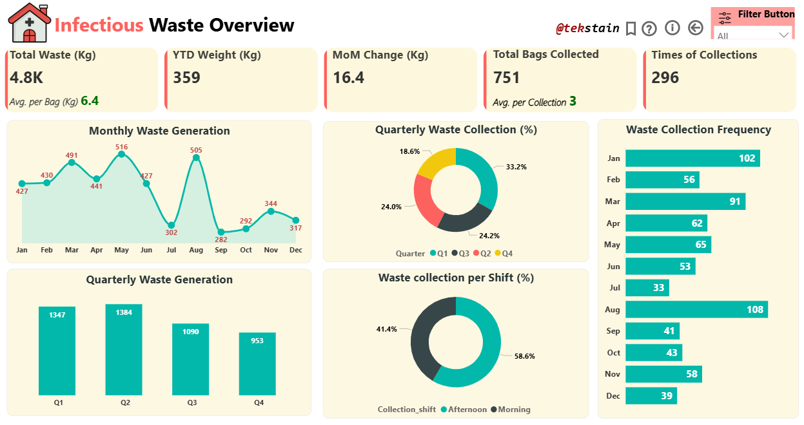
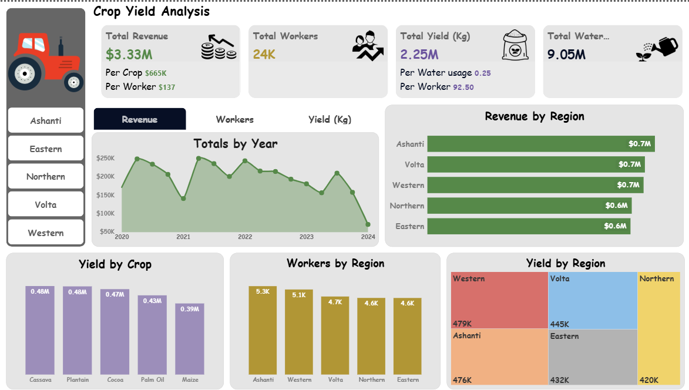
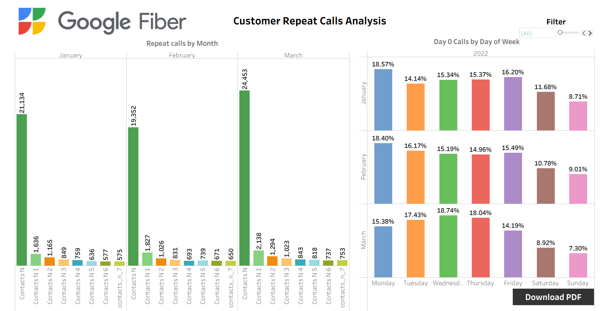
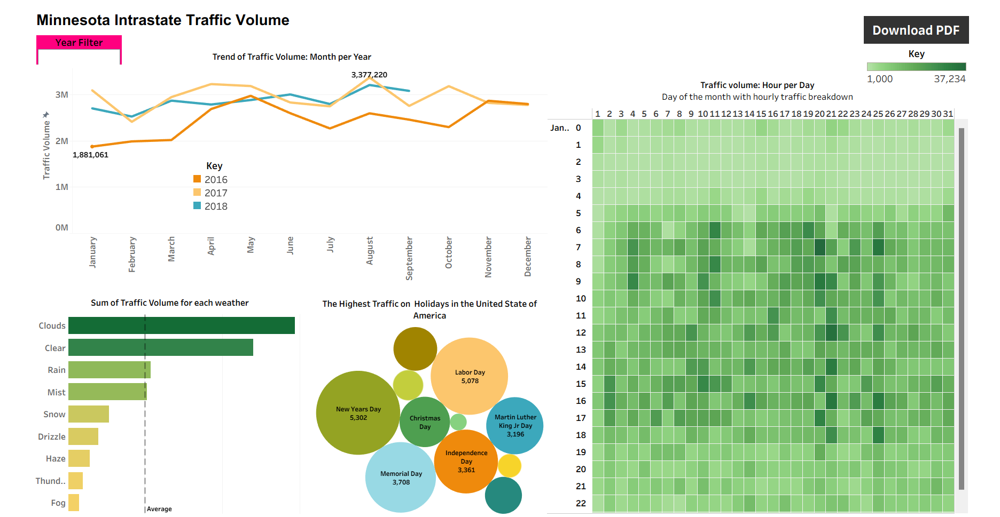
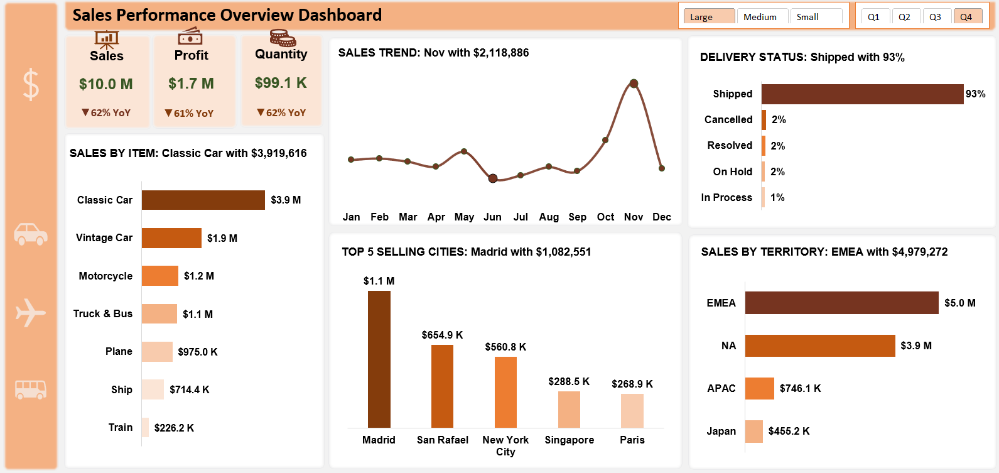

# Data Analyst
Data Analysis | Business Intelligence | Climate Tech

## About Me  
Hi, I’m Francis🙋a Data & BI Analyst 🤖 passionate about turning data into smarter, more sustainable decisions. I analyze data, build dashboards and reports that highlights business and environmental impact, automate workflows to cut waste, and design solutions that help organizations drive both business performance and climate resilience
 
**⚙️Services**  
- Builds end-to-end ETL pipeline to Extract Transform and Load data while managing databases.
- Clean, model data and design intuitive and insight driven dashboards for KPI monitoring to support data-driven decision making.
- Designs and automate AI workflows that scales operational efficiency and business impact.
- Consults on utility management and business sustainability.
- Account and report on organizational carbon emissions aligning business to Environmental Social Governance principles. 
- Leads cross-sectional events aligned with climate and sustainability goals.
- Biochemical research and analysis 

## Featured Projects

### Instagram-Twitter Analysis(Tableua)

### Hospital Infectious Waste Overview(Power BI)

[Read more...](https://github.com/Partron1/Infectious_waste)

### Real-Time Air Quality Monitoring Pipeline
**Streaming Pipeline Using Dataflow:**

Real-time data streaming pipeline for environmental monitoring that ingests IoT sensor data from multiple sources (PM2.5, PM10, CO, NO₂, O₃, temperature, humidity) to visualize and analyze city-level air quality in Accra.

**Source:** IoT sensors in cities stream air quality data (timestamp, location, PM2.5, PM10, CO, NO2, O3, temperature and humidity) levels every few seconds.
In this project, I used **Pub/sub to BigQuery**. The Pub/sub template is a streaming pipeline that can read JSON-formatted messages from a **Pub/Sub topic** and write them to a **BigQuery table**

**Pipeline:**
- Pub/sub (Raw messages)
- Dataflow (Custom User Defined Function (UDF) stage: clean/transform/enrich)
- BigQuery (Analytics-ready table)

**Dashboard:**
Tableau showing city-level pollution, alerts when thresholds are exceeded. 

**Impact:** Demonstrates environmental monitoring for smart cities.

[Read More](https://github.com/Partron1/realtime-analytics-pipeline)

### Multi-year agricultural performance data across five regions with Power BI 

What Can Crop Yield Data Teach us About Sustainable Agriculture in Ghana?

### Fiber Call Center Analytics

This project analyzes Google Fiber Customer caller complains for management to make informed descisions

[Read More](https://github.com/Partron1/fiber-caller-analytics)

### Tableau_Hands-on_Project

This Project features a Dashboard built with **Tableau** to analyse Traffic volume.

[Read More](https://github.com/Partron1/Tableau_Hands-on_Project/blob/main/README.md)

### Sales Performance Overview

This Dashboard is for analysis of Vehicle sales performance. The project was built solely on **Power Query** and **Excel**

[Read More](https://github.com/Partron1/Sales_performance)

## Skills 
- **Analytics Tools:** Power BI, Tableau, Excel
- **Databases:** MySQL, BigQuery
- **Programing:** Python (Pandas, Matplotlib), R, DAX 
- **Collaboration:** GitHub, Google Workspace, Notion, Airtable, Zoom, Slack, Teams
- **Concepts:** ETL, Data modeling, KPI reporting, Dashboard Design, Data cleaning, AI & Workflow Automations
- **Climate & Sustainability:** Green digital skills & Event Management.
  
## Certifications
- **DataCamp:** [Introduction To Python](https://www.datacamp.com/completed/statement-of-accomplishment/course/9c0b43dca3a6d94bc04bc2cd9e4131231b01c947?utm_medium=organic_social&utm_campaign=sharewidget&utm_content=soa&utm_source=copylink)    
- **Cisco Academy:** [Introduction to Greenhouse Gas Accounting for IT](https://www.credly.com/badges/f36ef4a9-81d7-4bd3-87e7-e0275ce518ed/public_url) 
- **Google:** [Business Intelligence Certificate](https://www.credly.com/badges/bd554006-162a-4209-8e54-e74d541168ea/public_url), Coursera 
- **Google:** [Data Analytics Professional Certificate](https://coursera.org/share/c7cd602f7a00a276d8efb46e49edaf75), Coursera 
- **Google:** [Google AI Essentials](https://coursera.org/share/9441b7314b152d66eb22a3aa86840dea), Coursera 
- **Cisco Academy:** [Data Analytics Essentials](https://www.credly.com/badges/82b47772-f677-418f-80f5-32958f509e80/public_url)  
- **INCO Academy:** [Green Digital Skills](https://learning.inco-group.co/pluginfile.php/1/tool_certificate/issues/1734278944/6549463484FA.pdf)  
- **Cisco Academy:** [Python Essentials 1](https://www.credly.com/badges/8d3e7a4c-f96f-4f7e-b7fc-c72a8347a134/public_url)  
- **FutureLearn:** [Making Sense of Genomic Data: COVID-19 Web-Based Bioinformatics](https://www.futurelearn.com/certificates/cry54yf)        
  
**Reach out at:**

|            |                                                    |                                                            
|------------|----------------------------------------------------|
| 📧   Email   | [Defrancees@gmail.com](mailto:Defrancees@gmail.com)|
| LinkedIn        |[@Francis Partron Addo](https://linkedin.com/in/tekstain-gh) |
| Circle    | [@Francis Partron Addo](https://circle.4ward.earth/u/fc41d176)|
| 💼 My Resume     | [Download Resume](assets/Resume.pdf) |

*Let’s connect and solve problems that matter with data, climate, purpose, and innovation.*
