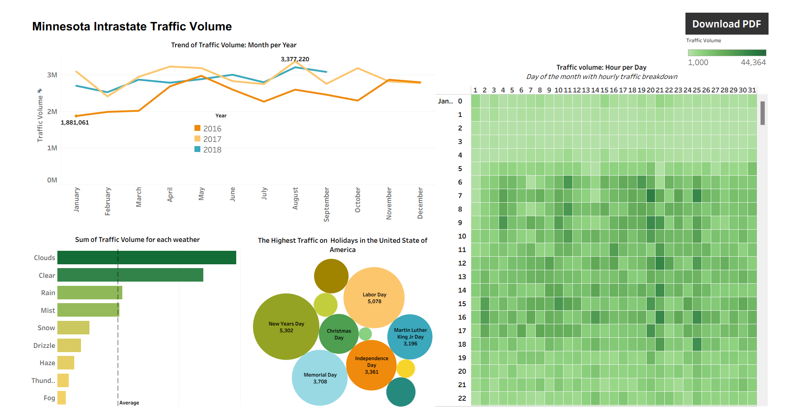

# MY PORTFOLIO
🔹 **ABOUT ME**  
Hi, I’m Francis 🙋 a Data Analyst and BI Analyst 🤖 with a passion for using data and automation to solve real-world problems.

With a foundation in climate and sustainability 🌱, I help organizations turn complex data into clear insights and smarter decisions. I enjoy building dashboards, automating workflows, and finding ways to make operations more efficient and sustainable.

🔹 **SERVICES**  
- *Build interactive dashboards and data pipelines to inform decisions*  
- *Design and automate AI workflows that scale impact*  
- *Lead cross-functional programs aligned with climate and sustainability goals*

Let’s connect and solve problems that matter with data, purpose, and innovation.

🔹 **MY PROJECT**  
*Take a glimpse on some few projects I'v worked on:*
This a hands-on project I have complete of product sales performance on vehicles. 
  
[Read More](https://github.com/Partron1/Sales_performance)
🔹 **CONTACT DETAILS**  
*Lets get connected and make impact: **Together We Can Do Great Things!***
